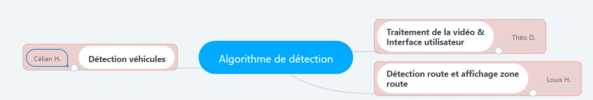

# ADR - Logiciel de détection de l'environnement routier en python
Projet d'ISN - Lycée Louis Armand : Mulhouse, par Théo DURR, Louis HECTOR et Célian HUMBERT

## Analyse des besoins et faisabilité
Le logiciel doit être capable de détecter des éléments liés à l'environnement que pourrait rencontrer une voiture lors de son utilisation.

## Spécifications / Fonctionnalités
Le logiciel doit être capable de : 
  - [ ] Marquages au sol
  - [ ] Véhicules

## Prérequis pour le développement
  * Python 3.7.2
    * Pip 19.0.3 `python -m pip install pip --upgrade`
    * OpenCV `python -m pip install opencv-contrib-python --upgrade`
    * Tensorflow `python -m pip install tensorflow`

## Répartition des tâches 

## Travailler sur le projet
  * Cloner le repository `git clone https://github.com/TheoDurr/adr`
