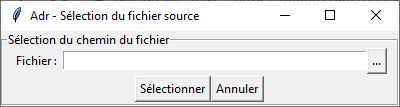
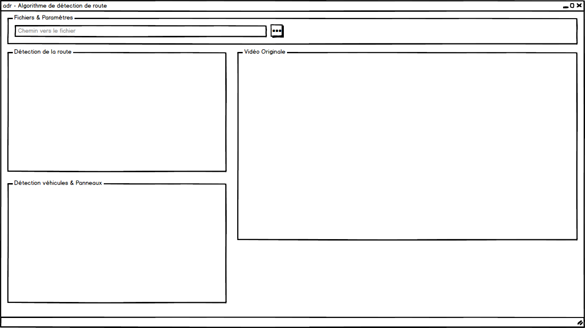
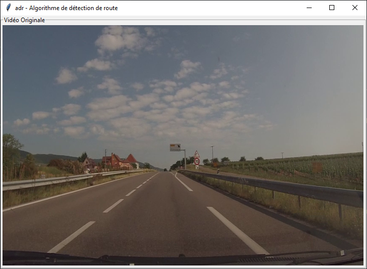

# ADR - Logiciel de détection de l'environnement routier en python
Projet d'ISN - Lycée Louis Armand : Mulhouse, par Théo DURR, Louis HECTOR et Célian HUMBERT

# DOSSIER TECHNIQUE - Théo DURR
## Introduction
Notre projet consiste en la réalisation et, plus particulièrement, en la mise en place d’un programme permettant de détecter sur une vidéo, à la foi la route et ses usagers tels que les voitures, les bus et certains éléments de la signalisation et d’en effectuer un suivi par encadrement. Il consiste également en la réalisation d’une interface permettant de sélectionner le fichier à traiter et d’afficher les vidéos traitées et analysées par nos modèles.
Pour ma part, il s'agit de créer l'interface permettant de sélectionner le chemin de la vidéo, ainsi que celle qui permettra d'afficher la vidéo originale et les deux vidéos traitées

### Analyse des besoins et faisabilité
Le logiciel doit être capable de détecter des éléments liés à l'environnement que pourrait rencontrer une voiture lors de son utilisation.

### Répartition des tâches 


### Spécifications / Fonctionnalités
Le logiciel doit être capable de détecter les choses suivantes : 
  - [x] Marquages au sol
  - [x] Véhicules

### Prérequis pour le développement
Pour travailler sur ce projet, nous utiliserons python ainsi que diverses librairies :
  * Python 3.7.2
    * Pip 19.0.3 (gestionnaire de librairies) `python -m pip install pip --upgrade`
    * OpenCV (gestion des images et des vidéos / détection route)`python -m pip install opencv-contrib-python --upgrade`
    * Tensorflow (Modèle d'apprentissage automatisé) `python -m pip install tensorflow`
    * Tkinter (Gestion de l'interface graphique)

## Fenêtre de sélection du fichier
### Apercu


### Code
```python
# ─── IMPORT DES LIBRAIRIES ──────────────────────────────────────────────────────
from tkinter import filedialog
import tkinter as tk

# ─── CALLBACKS ─────────────────────────────────────────────────────
def openFile():
    filePath = filedialog.askopenfilename(
        initialdir = "/",
        title = "Selectionner le fichier",
        filetypes = (("Fichier mpeg","*.mp4"),("Tous les fichiers","*.*")))
    fileEntry.set(filePath)
def launchApp():
    print(fileEntry.get())
    mainWindow.quit()
    app.App(tk.Tk(),"adr - Algorithme de détection de route", fileEntry.get())
        
# ─── PROGRAMME PRINCIPAL ────────────────────────────────────────────────────────
mainWindow = tk.Tk()
mainWindow.title("Adr - Sélection du fichier source")

windowFrame = tk.LabelFrame(mainWindow, text = "Sélection du chemin du fichier", padx = 10)
windowFrame.pack(fill = "both")

fileFrame = tk.Frame(windowFrame)
fileFrame.pack()

fileLabel = tk.Label(fileFrame, text = "Fichier : ")
fileLabel.pack(side = "left")

fileEntry = tk.StringVar()
entryField = tk.Entry(fileFrame, textvariable = fileEntry, width = 50).pack(side = "left")

explorerMenu = tk.Button(fileFrame, text = "...", command = openFile)
explorerMenu.pack()

buttonFrame = tk.Frame(windowFrame, pady = 2)
buttonFrame.pack(fill = "y")

validateButton = tk.Button(buttonFrame, text = "Sélectionner", command = launchApp)
validateButton.pack(side = "left")
cancelButton = tk.Button(buttonFrame, text = "Annuler", command = mainWindow.quit).pack(side = "left")

mainWindow.mainloop()
```

Dans un premier temps, nous importons toutes les librairies nécessaire au bon fonctionnement du programme, l'utilité de chacune d'elle est expliquée plus haut dans l'introduction.
```python
# ─── IMPORT DES LIBRAIRIES ──────────────────────────────────────────────────────
from tkinter import filedialog
import tkinter as tk
```

Ensuite, nous créons les deux fonctions qui seront appelées lors du clic sur les boutons `...` et `Sélectionner`. Ces fonctions sont appelées des [**callbacks**](https://www.codefellows.org/blog/what-is-a-callback-anyway/).
```python
# ─── CALLBACKS ─────────────────────────────────────────────────────
def openFile():
    filePath = filedialog.askopenfilename(
        initialdir = "/",
        title = "Selectionner le fichier",
        filetypes = (("Fichier mpeg","*.mp4"),("Tous les fichiers","*.*")))
    fileEntry.set(filePath)
def launchApp():
    print(fileEntry.get())
    mainWindow.quit()
    app.App(tk.Tk(),"adr - Algorithme de détection de route", fileEntry.get()) # Appel de l'application
```

Le reste du code comprend la création de l'interface permettant de choisir le fichier en question :
```python
# ─── PROGRAMME PRINCIPAL ────────────────────────────────────────────────────────
mainWindow = tk.Tk()
mainWindow.title("Adr - Sélection du fichier source")

windowFrame = tk.LabelFrame(mainWindow, text = "Sélection du chemin du fichier", padx = 10)
windowFrame.pack(fill = "both")

fileFrame = tk.Frame(windowFrame)
fileFrame.pack()

fileLabel = tk.Label(fileFrame, text = "Fichier : ")
fileLabel.pack(side = "left")

fileEntry = tk.StringVar()
entryField = tk.Entry(fileFrame, textvariable = fileEntry, width = 50).pack(side = "left")

explorerMenu = tk.Button(fileFrame, text = "...", command = openFile)
explorerMenu.pack()

buttonFrame = tk.Frame(windowFrame, pady = 2)
buttonFrame.pack(fill = "y")

validateButton = tk.Button(buttonFrame, text = "Sélectionner", command = launchApp)
validateButton.pack(side = "left")
cancelButton = tk.Button(buttonFrame, text = "Annuler", command = mainWindow.quit).pack(side = "left")

mainWindow.mainloop()
```
Ce dernier morceau de code utilise de très nombreuses librairies Tkinter et énormément de méthodes de cette librairie.
## Fenêtre d'affichage des vidéos
### Attendu


### Résultat


Cette partie n'est pas aboutie en raisons de divers problèmes que je n'ai pas réussi à résoudre. En effet, j'ai constaté que mon architecture logicielle n'était pas adapté à l'affichage de plusieurs vidéos différentes. Il aurait fallu que je fasse une classe différente pour la vidéo et son traitement. De même pour la liaison entre l'interface de sélection du fichier et l'interface d'affichage des vidéos. Une solution serait de ne pas créer cette première interface et d'ajouter le chemin de la vidéo en argument après l'appel du script python comme ceci :

```bash
projet-isn > python adr.py D:/videos/input.mp4
```

### Code
```python
# ─── IMPORT DES LIBRAIRIES ──────────────────────────────────────────────────────
import tkinter as tk 
import cv2 as cv
from PIL import Image, ImageTk

# ─── CREATION DES CLASSES ───────────────────────────────────────────────────────
class App:
    def __init__(self, window, windowTitle, videoSource = 0):
        self.window = window
        self.window.title(windowTitle)
        self.videoSource = videoSource

# ─── AFFICHAGE VIDEO ────────────────────────────────────────────────────────────
        self.originalVideoFrame = tk.LabelFrame(window, text = "Vidéo Originale")
        self.originalVideoFrame.pack(fill = "x")

        self.originalVid = MyVideoCapture(videoSource)

        self.canvas = tk.Canvas(self.originalVideoFrame, width = self.originalVid.width, height = self.originalVid.height)
        self.canvas.pack()

        self.delay = 10
        self.update()
        self.window.mainloop()
    def update(self):
        ret, frame = self.originalVid.getFrame()

        if ret:
            self.photo = ImageTk.PhotoImage(image = Image.fromarray(frame))
            self.canvas.create_image(0, 0, image = self.photo, anchor = tk.NW)

        self.window.after(self.delay, self.update)
# ────────────────────────────────────────────────────────────────────────────────
# ─── TRAITEMENT DE LA VIDEO ─────────────────────────────────────────────────────
class MyVideoCapture:
    def __init__(self, videoSource = 0):
        self.vid = cv.VideoCapture(videoSource)
        if not self.vid.isOpened():
            raise ValueError("Impossible d'ouvrir le fichier vidéo", videoSource) # Chemin de fichier non renseigné ou invalide
        
        # Dimensions de la vidéo
        self.width = 720
        self.height = 480
    
    def __del__(self):
        if self.vid.isOpened():
            self.vid.release()

    def getFrame(self):
        if self.vid.isOpened():
            ret, frame = self.vid.read()

            frame = cv.resize(frame, (self.width,self.height))

            if ret:
                return(ret, cv.cvtColor(frame, cv.COLOR_BGR2RGB))
            else:
                return(ret, None)
        else:
            return(ret, None)
# ────────────────────────────────────────────────────────────────────────────────
# ────────────────────────────────────────────────────────────────────────────────

if __name__ == "__main__":
    App(tk.Tk(),"adr - Algorithme de détection de route", "videos/road_car_view.mp4")
```

Dans ce programme, nous importons à nouveau toutes les librairies nécessaires au bon fonctionnement. Ensuite nous créons les deux classes principales du programmes en language orienté objet.
```python
# ─── CREATION DES CLASSES ───────────────────────────────────────────────────────
class App:
    def __init__(self, window, windowTitle, videoSource = 0):
        self.window = window
        self.window.title(windowTitle)
        self.videoSource = videoSource

# ─── AFFICHAGE VIDEO ────────────────────────────────────────────────────────────
        self.originalVideoFrame = tk.LabelFrame(window, text = "Vidéo Originale")
        self.originalVideoFrame.pack(fill = "x")

        self.originalVid = MyVideoCapture(videoSource)

        self.canvas = tk.Canvas(self.originalVideoFrame, width = self.originalVid.width, height = self.originalVid.height)
        self.canvas.pack()

        self.delay = 10
        self.update()
        self.window.mainloop()
    def update(self):
        ret, frame = self.originalVid.getFrame()

        if ret:
            self.photo = ImageTk.PhotoImage(image = Image.fromarray(frame))
            self.canvas.create_image(0, 0, image = self.photo, anchor = tk.NW)

        self.window.after(self.delay, self.update)
# ────────────────────────────────────────────────────────────────────────────────
```
Ici, cette première classe `App` instancie l'application et tous les composants de l'interface graphique, elle crée également une instance de la classe `MyVideoCapture` et lui passe en argument le chemin de la vidéo à traiter. La méthode `update` indique à la classe `MyVideoCapture` de traiter l'image suivante de la vidéo avec un délay de 10ms, et affiche celle-ci.

```python
# ─── TRAITEMENT DE LA VIDEO ─────────────────────────────────────────────────────
class MyVideoCapture:
    def __init__(self, videoSource = 0):
        self.vid = cv.VideoCapture(videoSource)
        if not self.vid.isOpened():
            raise ValueError("Impossible d'ouvrir le fichier vidéo", videoSource) # Chemin de fichier non renseigné ou invalide
        
        # Dimensions de la vidéo
        self.width = 720
        self.height = 480
    
    def __del__(self):
        if self.vid.isOpened():
            self.vid.release()

    def getFrame(self):
        if self.vid.isOpened():
            ret, frame = self.vid.read()

            frame = cv.resize(frame, (self.width,self.height))

            if ret:
                return(ret, cv.cvtColor(frame, cv.COLOR_BGR2RGB))
            else:
                return(ret, None)
        else:
            return(ret, None)
# ────────────────────────────────────────────────────────────────────────────────
```
La classe `MyVideoCapture` vérifie si le chemin de la vidéo est correct et renseigné (et renvoie une erreur le cas échéant). Il traite la vidéo en la redimensionnant au format `720x480 px`.

Ici encore, mon choix d'architecture logicielle n'est pas judicieux puisque je ne peux pas afficher plusieurs vidéos qui seraient traitées de manière différente, car je devrais à chaque fois instancier une application supplémentaire (application qui crée une interface).

Par manque d'expérience toujours, mais également par manque d'optimisation (le programme consomme beaucoup trop de ressources processeur), nous n'avons pas pu fusionner les trois parties de notre projet pour n'en faire qu'une seule. Cependant, les trois parties fonctionnent indépendament.


## Etudier le projet
Pour faire fonctionner ce programme et en étudier le code, il vous faut télécharger les sources :
  * Dupliquer ce repository `git clone https://github.com/TheoDurr/adr`
